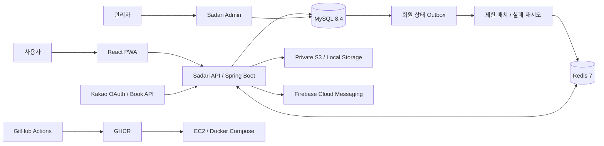
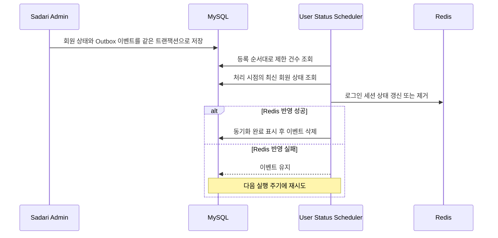

# Sadari

> 독서의 즐거움에 오르다

[](https://github.com/hwaiplay/sadari/actions/workflows/ci-cd.yml)


Sadari는 도서 검색, 독서 기록과 목표, 소셜 활동, 독서 모임, 알림과 웹 푸시를 하나의 흐름으로 연결한 서비스입니다. 이 저장소는 사용자용 React PWA와 Spring Boot API를 함께 관리하며, 별도 [관리자 서비스](https://github.com/vellahw/sadari-admin)가 공통 운영 테이블을 통해 서비스의 제어면을 담당합니다.

## 프로젝트 핵심

| 관점 | 구현 내용 |
| --- | --- |
| 데이터 일관성 | 도서 마스터와 독후감 등록을 하나의 트랜잭션으로 처리하고, DB 커밋 결과에 맞춰 푸시 발송과 파일 정리를 수행합니다. |
| 인증과 세션 | Kakao OAuth 2.0, `sid`를 포함한 JWT, HttpOnly Cookie, CSRF Token과 Redis 기기별 세션을 결합했습니다. |
| 조회 성능 | 마이페이지 독서 요약 SQL 왕복을 최대 19회에서 2회로 통합했습니다. 이는 소스 기준 호출 횟수 감소이며 응답 시간 개선율을 뜻하지 않습니다. |
| 서비스 간 정합성 | 관리자 회원 상태 변경을 DB Outbox에 기록하고, 사용자 서비스가 성공한 이벤트만 삭제해 Redis 반영 실패를 재시도합니다. |
| 파일 보안 | 이미지 시그니처·디코더·해상도를 검증하고 EXIF 방향 보정과 재인코딩을 거쳐 비공개 S3 또는 로컬 저장소에 보관합니다. |
| 운영 가능성 | 관리자가 공통 코드, 알림 템플릿, 사용자 메뉴와 스케줄러 상태를 관리하고 실행 건수·처리 시간·실패 원인을 확인할 수 있습니다. |
| 배포 자동화 | 멀티 스테이지 Docker 빌드, GHCR 이미지 배포, EC2 Docker Compose 갱신과 HTTP 상태 확인을 GitHub Actions로 구성했습니다. |

## 주요 기능

| 영역 | 사용자 경험 | 백엔드 구현 |
| --- | --- | --- |
| 도서 | Kakao 도서 검색, 표지 색상 탐색 | 검색 API 연동, 표지 대표색 추출, CIELAB 거리 기반 공통 색상 매칭 |
| 독서 기록 | 읽기 상태, 별점, 독후감, 기간별 독서량 | 도서·독후감 원자적 등록, 공개 범위, 목표 집계와 목록 조회 |
| 독서 목표 | 주간·월간·연간 목표와 달성 현황 | 기간 경계 계산, 이전 목표 복사, 조건부 집계 |
| 소셜 | 팔로우, 프로필, 좋아요, 댓글 | 공개 데이터 범위 제어, 대상 유형 기반 반응 데이터 모델 |
| 콘텐츠 안전 | 닉네임·한줄소개·독후감·댓글의 비속어 입력 차단 | 공통코드 사전, 10분 캐시, Aho-Corasick 탐지와 허용어 범위 예외 처리 |
| 독서 모임 | 모임 생성, 가입과 활동 관리 | 모임 상태·권한·정원 정책, 가입 요청과 멤버십 처리 |
| 알림과 푸시 | 서비스 알림, PWA 웹 푸시 | 템플릿 알림, 중복 방지, 커밋 후 FCM 발송, 구독 관리 |
| 계정 | 로그인, 현재·전체 디바이스 로그아웃, 비활성화, 탈퇴 예약과 취소 | Redis 기기별 세션, 상태 기반 접근 제한, `WITHDRAWN`·`DELETE_PENDING` 수명주기 |

## 시스템 구성



사용자 서비스와 관리자 서비스는 서로의 API를 직접 호출하지 않습니다. 두 서비스가 공유하는 운영 테이블에 쓰기 주체와 읽기 주체를 구분해, 사용자 요청 경로와 운영 제어 경로의 결합도를 낮췄습니다.

## 백엔드 설계 하이라이트

### 1. 반복 조회를 집계 SQL과 단일 목록 조회로 통합

마이페이지는 기간별 독서량, 목표, 달성 횟수와 도서 목록을 만들기 위해 최대 19번의 SQL을 실행하고 있었습니다. 완료 독후감을 CTE와 조건부 집계로 한 번 집계하고, 현재 읽는 책과 올해 완료 목록을 한 번 조회한 뒤 애플리케이션에서 기간별로 분류하도록 변경했습니다.

| 지표 | 개선 전 | 개선 후 | 변화 |
| --- | ---: | ---: | ---: |
| 전체 SQL 호출 | 최대 19회 | 2회 | 89.5% 감소 |
| 집계 SQL | 15회 | 1회 | 14회 감소 |
| 목록 SQL | 4회 | 1회 | 3회 감소 |
| JDBC 전체 평균 | 264.725ms | 37.346ms | 85.89% 감소 |
| JDBC 전체 중앙값 | 215.241ms | 26.436ms | 87.72% 감소 |
| JDBC 전체 P95 | 578.272ms | 80.201ms | 86.13% 감소 |

실측값은 2026년 8월 11일 Windows 11·Java 17 클라이언트에서 비로컬 MySQL 8.4.10 개발 DB를 대상으로 준비 10회 후 100회 반복한 결과입니다. 전체 독후감 11건·목표 9건 중 독후감 6건·목표 4건을 가진 익명 사용자를 선택했으며, 같은 읽기 전용 JDBC 연결에서 실행 순서를 번갈아 측정하고 모든 결과 행을 소비했습니다. 개선 전 19회 결과와 개선 후 2회 결과의 기간 집계·목표·달성 횟수·목록이 같은지도 먼저 검증했습니다.

단일 DB 왕복 중앙값은 9.377ms였고 확인한 대표 실행 계획의 DB 내부 실행은 모두 1ms 미만이었습니다. 따라서 이 환경의 87.72% 중앙값 감소는 복잡한 CTE 자체가 더 빠르기 때문이라기보다 네트워크 왕복을 17회 줄인 효과가 중심입니다. 이 수치는 Spring MVC·MyBatis·HikariCP·JSON 직렬화를 포함한 API 응답 시간이 아니며, 데이터가 적은 개발 DB의 결과이므로 운영 성능으로 일반화하지 않습니다.

데이터 증가에 따른 변화를 확인하기 위해 동일한 Windows 11 호스트의 격리 MySQL 8.4.10에 최근 5년치 독후감과 주·월·연 목표 329건을 생성해 추가 측정했습니다. `DONE` 90%, `READ` 10%로 구성하고 준비 5회 후 30회 반복했으며, 개선 전후 실행 순서를 번갈아 모든 결과 행을 소비했습니다.

| 더미 독후감 | 개선 전 중앙값 | 개선 후 중앙값 | 중앙값 감소 | 개선 배수 | 개선 전/후 P95 |
| ---: | ---: | ---: | ---: | ---: | ---: |
| 100건 | 14.953ms | 5.664ms | 62.12% | 2.64배 | 21.242ms / 7.233ms |
| 1,000건 | 34.558ms | 16.296ms | 52.85% | 2.12배 | 39.175ms / 18.138ms |
| 10,000건 | 314.315ms | 175.091ms | 44.29% | 1.80배 | 435.453ms / 269.750ms |

세 규모 모두 기간별 독서량·목표·목표 수정 횟수·달성 횟수와 네 종류의 목록 결과가 일치했습니다. 로컬 루프백 환경에서는 네트워크 지연이 작아 데이터가 늘수록 17회 왕복 감소보다 CTE 집계와 통합 목록 처리 비용의 비중이 커졌지만, 10,000건에서도 중앙값은 44.29% 감소했습니다. 이 결과 역시 단일 연결 JDBC 조회 벤치마크이며 동시 요청과 API 계층을 포함한 운영 지표는 아닙니다.

- [성능 개선 과정과 트레이드오프](docs/performance/my-page-reading-summary-optimization.md)
- [집계 SQL](src/main/java/org/our/sadari/report/mapper/ReportMapper.xml)

### 2. 인증 상태를 토큰 한 장이 아닌 수명주기로 관리

Kakao OAuth 로그인 이후 기기별 세션 식별자 `sid`를 포함한 Access Token과 Refresh Token을 발급하고 HttpOnly Cookie로 전달합니다. Redis에는 `auth:session:{sid}` Hash와 회원별 `sid` Set을 생성해 로그인마다 독립된 Refresh Token 세션을 관리합니다. 세션과 회원별 색인은 Refresh Token 유효시간으로 만료·갱신하고, 닉네임은 활성 세션 TTL 캐시로, 계정 상태는 로그아웃으로 지워지지 않는 별도 캐시로 유지합니다.

`JwtFilter`는 서명과 만료뿐 아니라 JWT의 `sid`가 Redis에서 해당 회원의 활성 세션인지 확인하고 계정 상태 캐시가 없으면 DB 원본으로 보정합니다. 비활성화 계정과 영구 탈퇴 대기 계정은 허용된 복구·취소 흐름을 제외한 API 접근이 제한됩니다.

쿠키 인증을 사용하더라도 CSRF 보호를 끄지 않았습니다. 상태 변경 요청은 서버가 발급한 CSRF Token을 `X-XSRF-TOKEN` Header로 검증하며, 브라우저에서 Token 불일치가 발생하면 새 Token을 받은 뒤 원 요청을 한 번만 재시도합니다. 한 탭의 여러 API는 하나의 Refresh 요청 Promise를 공유하고, 여러 탭과 서비스워커의 동시 재발급은 Redis Lua 회전과 기본 10초 유예시간으로 같은 최신 토큰에 수렴합니다.

로그아웃 Alert에서는 현재 디바이스와 전체 디바이스를 구분합니다. 현재 디바이스 로그아웃은 현재 `sid`와 브라우저 푸시 구독만 제거하고, 전체 디바이스 로그아웃은 회원의 모든 `sid`와 푸시 구독을 비활성화합니다. 같은 브라우저 프로필의 탭은 Cookie를 공유하므로 `BroadcastChannel`과 `storage` 이벤트로 로그아웃 상태를 즉시 동기화합니다. 로그아웃한 Access Token의 `jti`는 남은 만료 시간 동안 Redis 블랙리스트에 유지합니다.

- [인증과 보안 설계](docs/portfolio/auth-security.md)
- [계정 및 인증 정책](docs/policies/account-auth-policy.md)
- [Spring Security·CSRF·CORS 설정](src/main/java/org/our/sadari/global/security/config/SecurityConfig.java)
- [Redis 토큰·사용자 상태 관리](src/main/java/org/our/sadari/global/security/jwt/TokenRedisService.java)
- [JWT 요청 필터](src/main/java/org/our/sadari/global/security/jwt/JwtFilter.java)
- [CSRF·Refresh 단일 요청 처리](src/main/frontend/src/app/api/axios.ts)
- [계정 수명주기 정책](docs/policies/withdrawal-policy.md)

### 3. DB와 외부 시스템의 완료 시점을 분리

외부 시스템 호출을 DB 트랜잭션 안에서 성공한 것으로 간주하지 않습니다.

- 알림 데이터가 커밋된 뒤에만 FCM 푸시를 발송합니다.
- DB가 새 파일을 참조한 뒤 기존 물리 파일을 삭제합니다.
- DB가 롤백되면 해당 요청에서 먼저 생성한 물리 파일을 정리합니다.
- 도서 마스터가 없을 때 도서와 독후감 등록을 하나의 트랜잭션으로 처리합니다.

이를 통해 푸시는 발송됐지만 알림이 없는 상태, 롤백된 DB가 삭제된 파일을 계속 참조하는 상태, 도서만 남고 독후감 등록이 실패하는 상태를 줄였습니다.

- [알림 서비스](src/main/java/org/our/sadari/alim/service/AlimServiceImpl.java)
- [파일 서비스](src/main/java/org/our/sadari/global/file/service/FileService.java)
- [독후감 서비스](src/main/java/org/our/sadari/report/service/ReportServiceImpl.java)

### 4. 관리자 서비스를 운영 제어면으로 분리

별도 관리자 서비스는 사용자 트래픽을 처리하는 API와 분리되어 있지만 공통 운영 테이블을 통해 다음 설정을 제어합니다.

| 관리 대상 | 사용자 서비스의 적용 방식 |
| --- | --- |
| 공통 코드 | 상태값, 사용 여부와 기능 설정 조회 |
| 알림 템플릿 | 이벤트 코드에 맞는 제목과 본문 생성 |
| 사용자 메뉴 | 계층형 메뉴와 노출 여부 조회 |
| 스케줄러 설정 | 실행 가능 여부와 배치 제한 확인 |
| 스케줄러 로그 | 실행 결과, 처리 건수와 실패 원인 기록 |

사용자 메뉴는 `TM_URMENU`의 관리자 설정을 MySQL 재귀 CTE로 최대 3단계까지 조립합니다. 현재 URL과 가장 길게 일치하는 메뉴를 찾고 활성·노출 상태가 유효한 하위 트리만 반환하므로, 사용자 앱을 다시 배포하지 않고도 메뉴 구조와 노출 여부를 바꿀 수 있습니다.

- [사용자·관리자 연동 구조](docs/portfolio/admin-user-integration.md)
- [사용자 메뉴 재귀 조회 SQL](src/main/java/org/our/sadari/menu/mapper/UserMenuMapper.xml)
- [스케줄러 정책](docs/policies/scheduler-policy.md)

### 5. DB Outbox로 관리자 상태 변경을 Redis에 전달

관리자 서비스가 사용자를 정지하거나 해제할 때 DB 원본만 바뀌고 사용자 서비스의 Redis 상태가 남는 문제를 별도 이벤트 전달 흐름으로 해결했습니다.



이벤트에는 복제된 상태값 대신 회원 식별값을 저장하고, 소비 시점의 최신 DB 상태를 읽습니다. 빠르게 연속된 정지·해제 이벤트가 있어도 오래된 상태를 Redis에 덮어쓰지 않습니다. 한 이벤트가 실패해도 다음 회원 처리를 계속하며 대상·성공·실패 건수, 실행 시간과 대표 실패 원인을 스케줄러 이력으로 남깁니다.

- [회원 상태 Outbox 소비 서비스](src/main/java/org/our/sadari/global/scheduler/service/UserStatusEventServiceImpl.java)
- [Outbox Mapper](src/main/java/org/our/sadari/global/scheduler/mapper/UserStatusEventMapper.xml)
- [회원 정지 정책](docs/policies/user-suspension-policy.md)

### 6. 업로드 한 번을 보안 파이프라인으로 처리

이미지 업로드는 확장자와 브라우저의 Content-Type을 신뢰하지 않습니다.

1. JPEG·PNG 파일 시그니처를 확인합니다.
2. 이미지 디코더가 판별한 형식과 시그니처가 일치하는지 검사합니다.
3. 파일 크기, 한 변 길이와 전체 픽셀 수를 제한합니다.
4. EXIF Orientation을 실제 픽셀 방향에 반영합니다.
5. 픽셀만 새 이미지로 재인코딩해 메타데이터와 숨은 페이로드를 제거합니다.
6. 서버가 생성한 UUID 이름으로 로컬 또는 비공개 S3에 저장합니다.

모바일 PWA의 고해상도 프로필 이미지는 서버 임시 저장소에서 방향 보정과 축소 미리보기를 생성합니다. 임시 파일은 사용자와 이미지 유형별 경로로 격리하고 30분 TTL을 적용하며, 실제 경로 대신 UUID Token과 축소 Data URL만 반환합니다. 최종 DB 저장이 커밋된 뒤 임시 파일과 이전 이미지를 지우고, 롤백되면 새 영구 객체를 제거해 재시도 가능한 상태를 유지합니다.

저장소는 `FileStorage` 인터페이스 뒤에 로컬과 S3 구현을 분리했습니다. 브라우저에는 S3 객체 주소를 노출하지 않고 기존 `/uploads/...` 계약을 유지한 채 백엔드가 허용 디렉터리·날짜·UUID 형식을 검증해 이미지를 전달합니다.

- [콘텐츠·파일 보안 정책](docs/policies/content-file-policy.md)
- [이미지 검증·보상 처리](src/main/java/org/our/sadari/global/file/service/FileService.java)
- [저장소 추상화](src/main/java/org/our/sadari/global/file/storage/FileStorage.java)
- [비공개 이미지 전달 Controller](src/main/java/org/our/sadari/global/file/controller/FileResourceController.java)
- [S3 저장소 구현](src/main/java/org/our/sadari/global/file/storage/S3FileStorage.java)

### 7. 서비스 문제에 맞춘 알고리즘 적용

- 금칙어 검사는 DB 사전을 10분 캐시에 적재하고 Aho-Corasick 자동자를 미리 구성해 여러 패턴을 한 번에 탐색합니다. 캐시 만료 시 double-check locking으로 동시 DB 재조회와 자동자 재생성을 줄입니다.
- 한글·영문·숫자·공백 경계를 정규화하고 반복 문자 축약본과 제거본을 함께 검사합니다. 허용어가 문장에 있다는 이유로 전체 입력을 통과시키지 않고, 실제 금칙어 구간이 허용어 구간 안에 완전히 포함될 때만 예외로 처리합니다.
- 도서 표지는 유효 픽셀에서 대표색을 추출한 뒤 RGB 직선거리 대신 CIELAB 색차를 사용해 가장 가까운 공통 색상으로 분류합니다.

- [성능과 알고리즘 설계](docs/portfolio/performance-algorithms.md)
- [금칙어 탐지 서비스](src/main/java/org/our/sadari/global/common/service/BadWordDetectionService.java)
- [도서 표지 색상 서비스](src/main/java/org/our/sadari/book/service/BookCoverColorService.java)

### 8. 독서 모임의 좌석 경쟁을 트랜잭션에서 제어

독서 모임은 단순 게시판이 아니라 공개 범위, 가입 방식, 모임장 권한, 정원과 초대 만료를 함께 다룹니다. 즉시 가입과 승인, 초대 수락이 동시에 발생할 수 있으므로 화면에 보인 여석만 신뢰하지 않습니다.

- 가입·초대·승인 시 모임 행을 `SELECT ... FOR UPDATE`로 잠근 뒤 최신 좌석을 다시 계산합니다.
- 만료되지 않은 `INVITED` 멤버 행은 실제 회원과 함께 예약 좌석으로 계산합니다.
- 초대 수락은 새 회원을 추가하지 않고 예약된 행을 `ACTIVE`로 전환합니다.
- 가입 신청 결정은 `PENDING` 행을 잠그고 승인·거절 상태와 답변 삭제를 하나의 트랜잭션으로 처리합니다.
- 모임장만 수정·초대·가입 승인 업무를 실행하도록 서버에서 소유권을 다시 확인합니다.
- 사용자 관심분야와 모임 카테고리의 정확 일치 수를 집계해 공개 모임 추천 순서를 구성합니다.

- [독서 모임 Service](src/main/java/org/our/sadari/readingClub/service/ReadingClubServiceImpl.java)
- [좌석·잠금·추천 SQL](src/main/java/org/our/sadari/readingClub/mapper/ReadingClubMapper.xml)
- [독서 모임 설계](docs/architecture/reading-club-design.md)

### 9. API 실패를 사용자 화면의 복구 흐름까지 연결

백엔드의 공통 `ResultData` 코드와 프론트엔드의 오류 객체를 연결해 HTTP 성공 여부만으로 업무 성공을 판단하지 않습니다. Axios 공통 계층은 60초 Timeout, 인증 갱신, CSRF Token 갱신과 1회 재시도를 담당합니다.

등록·수정·삭제가 진행되는 동안에는 요청별 ID를 발급해 중첩 작업을 추적합니다. 마지막 작업이 끝날 때까지 처리 중 모달과 History 이동 가드를 유지해, 사용자가 뒤로가기나 PWA 스와이프로 화면을 이탈해 결과를 잃는 상황을 줄였습니다. 서비스워커 등록·푸시 초기화 실패는 기본 웹 화면과 분리하고, 준비 대기에도 Timeout을 둬 무한 로딩을 방지합니다.

- [공통 API와 복구 흐름](src/main/frontend/src/app/api/axios.ts)
- [상태 변경 화면 이동 가드](src/main/frontend/src/app/navigation/blockingOperation.ts)
- [서비스워커 등록](src/main/frontend/src/app/pwa/registerServiceWorker.ts)
- [FCM 초기화와 준비 Timeout](src/main/frontend/src/app/pwa/firebaseMessaging.ts)

### 10. 계정 탈퇴를 데이터 수명주기로 설계

계정 비활성화와 영구 탈퇴를 같은 삭제 버튼으로 처리하지 않습니다. 민감한 상태 변경 전에는 Kakao 재인증 `state`를 Redis에 10분 동안 보관하고, 외부 연결 해제가 성공한 뒤에만 내부 회원 상태를 변경합니다. 외부 연동에 실패하면 `UNLINK_PENDING` 이력으로 남기고 계정 제한을 적용하지 않습니다.

| 상태 | 의미 | 복구 기준 |
| --- | --- | --- |
| `WITHDRAWN` | 계정 비활성화 | 재로그인으로 `ACTIVE` 전환, 비공개·삭제·중지된 데이터는 자동 복원하지 않음 |
| `DELETE_PENDING` | 영구 삭제 대기 | 기본 30일 유예기간 안에 본인 재인증으로 취소 가능 |
| 물리 삭제 완료 | 회원과 삭제 대상 데이터 제거 | 복구 불가, 보존 대상 운영 이력은 비식별 기준 적용 |

알림, 푸시 구독, 팔로우, 좋아요, 독후감 공개 범위, 신고 이력과 독서 모임 권한을 상태별로 유지·중지·삭제·복원 범위에 맞춰 구분했습니다. 삭제 스케줄러는 유예기간이 지난 회원만 처리하고, 사용자 데이터와 파일 정리의 성공 여부를 실행 이력에 남깁니다.

- [계정 탈퇴 Service](src/main/java/org/our/sadari/user/service/UserWithdrawalServiceImpl.java)
- [영구 삭제 스케줄러 Service](src/main/java/org/our/sadari/global/scheduler/service/UserHardDeleteServiceImpl.java)
- [계정 수명주기 단일 기준 정책](docs/policies/withdrawal-policy.md)

## 기술 스택

| 구분 | 기술 |
| --- | --- |
| Backend | Java 17, Spring Boot 4.0.3, Spring MVC, Spring Security, MyBatis 4.0.1 |
| Data | MySQL 8.4, Redis 7, HikariCP |
| Auth | Kakao OAuth 2.0, JJWT 0.13, HttpOnly Cookie, Redis Lua Script |
| Frontend | React 19, TypeScript 5.9, Vite 7, TanStack Query 5, Zustand 5 |
| Messaging | Firebase Admin SDK, Firebase Cloud Messaging, PWA Push Subscription |
| Storage | Local File Storage, AWS SDK for Java 2.x, Private S3 |
| API | REST API, Bean Validation, OpenAPI 3, Swagger UI |
| Delivery | Gradle, multi-stage Docker, GitHub Actions, GHCR, EC2, Docker Compose |

## 저장소 구조

```text
sadari
├─ src/main/java/org/our/sadari
│  ├─ book, report, myPage        도서·독후감·목표와 독서 요약
│  ├─ social, reply, readingClub  소셜·댓글·독서 모임
│  ├─ alim, push                  알림·FCM 웹 푸시
│  ├─ user, menu, notice, popup   계정·메뉴·운영 콘텐츠
│  └─ global                     보안·파일·스케줄러·공통 응답
├─ src/main/frontend             React PWA
├─ src/test                      서비스·보안·파일·스케줄러 테스트
├─ docs                          정책·아키텍처·성능·배포 문서
├─ .github/workflows             CI/CD 파이프라인
├─ Dockerfile                    프론트엔드·백엔드 멀티 스테이지 빌드
└─ docker-compose.yml            애플리케이션·Redis 실행 구성
```

## 로컬 실행

### 사전 준비

- Java 17
- Node.js 24와 npm
- MySQL 8.4
- Docker와 Docker Compose
- Kakao OAuth·도서 검색, Firebase, 저장소 설정값

### Docker Compose

```bash
cp .env.example .env
# .env의 DB, Kakao, Firebase, 저장소 설정을 개발 환경에 맞게 입력합니다.
docker compose up --build
```

Docker Compose는 애플리케이션과 Redis를 실행합니다. MySQL은 `DB_URL`로 지정한 별도 인스턴스가 필요하며, 실제 비밀값이 들어간 `.env`와 Firebase 서비스 계정 파일은 저장소에 커밋하지 않습니다.

### 애플리케이션 직접 실행

```bash
./gradlew bootRun --args='--spring.profiles.active=loc'
```

```bash
cd src/main/frontend
npm install
npm run dev
```

로컬 프로필은 개발 DB·Redis·OAuth 환경에 맞게 구성해야 합니다. 세부 배포 변수와 프로필 기준은 [GitHub Actions 배포 문서](docs/github-actions-deployment.md)를 참고합니다.

## 검증과 품질 관리

- `src/test`에 인증, 알림, 파일 저장소, 스케줄러, 도서 검색과 서비스 계층 테스트가 포함되어 있습니다.
- Docker 빌드는 React 정적 자산과 Spring Boot WAR를 각각 빌드한 뒤 Java 17 JRE 이미지에 결합합니다.
- GitHub Actions는 Pull Request에서 패키지 빌드를 검증하고, `main` 반영 시 GHCR 게시와 EC2 배포 상태 확인을 수행합니다.
- 현재 CI의 빌드 검증은 로컬 MySQL·Redis와 Git에서 제외된 프로필에 의존하는 테스트 때문에 `-x test`를 사용합니다. 따라서 CI 배지와 빌드 성공을 전체 테스트 통과로 해석하지 않습니다.

문서 변경은 코드·설정의 현재 상태를 기준으로 작성하며, 측정값과 소스에서 계산한 값, 향후 기대 효과를 구분해 기록합니다.

## 문서

| 문서 | 내용 |
| --- | --- |
| [프로젝트 개요와 아키텍처](docs/portfolio/project-overview.md) | 도메인 구성, 요청 흐름과 기술 선택 |
| [백엔드와 데이터 설계](docs/portfolio/backend-data.md) | 트랜잭션, 공통 코드, 소셜 데이터 모델 |
| [인증과 보안](docs/portfolio/auth-security.md) | OAuth, JWT, Redis, 계정 상태와 파일 보안 |
| [성능과 알고리즘](docs/portfolio/performance-algorithms.md) | SQL 통합, Aho-Corasick, CIELAB |
| [알림과 스케줄러](docs/portfolio/notification-scheduler.md) | 템플릿 알림, FCM, 배치와 실행 로그 |
| [정책 문서 모음](docs/policies/README.md) | 계정, 콘텐츠, 알림, 소셜과 운영 정책 |
| [운영 문서 모음](docs/operations/README.md) | MySQL 초기화와 운영 절차 |
| [배포 설정](docs/github-actions-deployment.md) | GitHub Secrets·Variables, GHCR와 EC2 배포 |

## 다음 개선 과제

- CI 전용 테스트 프로필과 Testcontainers를 도입해 테스트를 필수 배포 게이트로 전환
- 다중 인스턴스 환경을 위한 스케줄러 분산 락과 실행 소유권 관리
- 대량 푸시 처리를 위한 비동기 큐, 재시도 정책과 실패 메시지 보관
- 운영 트래픽 기준 API 평균·P95·P99 응답 시간과 DB 실행 계획 측정
- 정적 AWS Access Key를 EC2 IAM Role 또는 단기 자격 증명 방식으로 전환

## 관련 저장소

- 사용자 서비스: [hwaiplay/sadari](https://github.com/hwaiplay/sadari)
- 관리자 서비스: [vellahw/sadari-admin](https://github.com/vellahw/sadari-admin)
