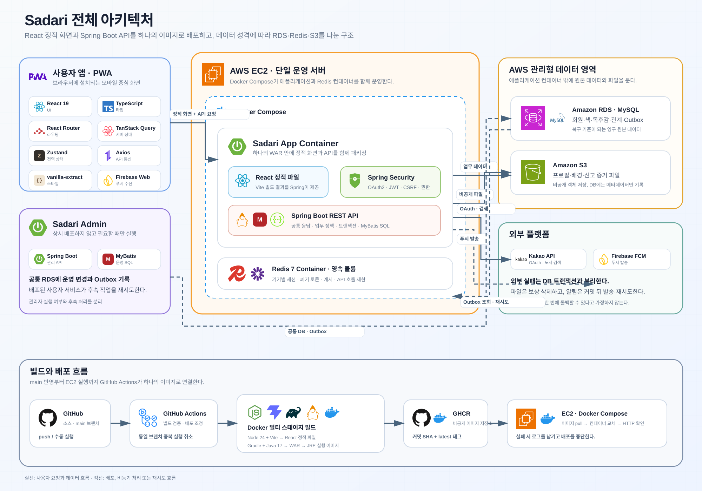
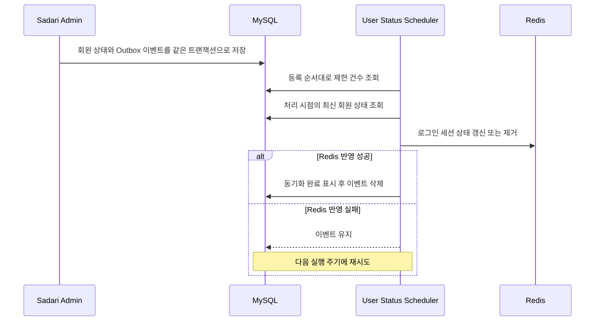

# Sadari

> [독서의 즐거움에 오르다](https://sadaribooks.com)

Sadari는 독서 기록, 목표, 소셜 활동과 독서 모임을 연결한 React PWA 기반 독서 플랫폼입니다. 인증 수명주기, 데이터 정합성, 동시성, 파일 보안과 운영 자동화까지 실제 서비스 문제를 중심으로 설계했습니다.

## 프로젝트 정보

| 항목 | 내용 |
| --- | --- |
| 개발 기간 | 2026.03 ~ 진행 중 |
| 개발 형태 | 2인 팀 프로젝트 |
| 서비스 구성 | 사용자 React PWA, Spring Boot API, 별도 관리자 서비스 |
| 주요 기여 영역 | 다중 기기 인증·세션, S3 파일 저장, 사용자·관리자 연동, 성능 측정과 문서화 |
| 배포 구성 | GitHub Actions, GHCR, EC2, Docker Compose |

## 기술 스택

| 구분 | 기술 |
| --- | --- |
| Backend | Java 17, Spring Boot 4.0.3, Spring MVC, Spring Security, MyBatis 4.0.1 |
| Data | MySQL 8.4, Redis 7, HikariCP |
| Auth | Kakao OAuth 2.0, JJWT 0.13, HttpOnly Cookie, CSRF Token, Redis Lua Script |
| Frontend | React 19.2, TypeScript 5.9, Vite 7.3, TanStack Query 5, Zustand 5 |
| Messaging | Firebase Admin SDK, Firebase Cloud Messaging, PWA Push Subscription |
| Storage | Local File Storage, AWS SDK for Java 2.x, Private S3 |
| Delivery | Gradle, Multi-stage Docker, GitHub Actions, GHCR, EC2, Docker Compose |

## 핵심 성과

| 해결 과제 | 적용 내용 | 결과 |
| --- | --- | --- |
| 마이페이지 반복 조회 | 기간별 집계와 목록 쿼리 통합 | SQL 호출 최대 `19회 → 2회` |
| 다중 기기 인증 | JWT `sid`와 Redis 기기별 세션, Refresh Token 회전 | 현재·전체 기기 로그아웃과 세션 단위 폐기 지원 |
| 외부 API 쿼터 보호 | 50권 선조회, Redis Lua 회원 제한, 10분 공용 캐시와 앱 전체 호출 예산 | 50권 조회 기준 카카오 호출 최대 `5회 → 1회`, 단일 회원의 쿼터 독점 차단 |
| 외부 시스템 정합성 | DB 커밋 이후 FCM 발송·기존 파일 삭제, 롤백 시 신규 파일 보상 삭제 | DB·푸시·파일 간 불일치 가능성 축소 |
| 관리자 상태 동기화 | DB Outbox와 사용자 백엔드 재시도 소비 | Redis 장애 시 이벤트를 보존하고 다음 실행에서 재처리 |
| 독서 모임 동시성 | `SELECT ... FOR UPDATE`와 예약 좌석 계산 | 가입·초대·승인 경쟁 시 정원 초과 방지 |
| 이미지 보안 | 시그니처·디코더·해상도 검증, EXIF 보정과 재인코딩 | 확장자 위장과 메타데이터 기반 위험 차단 |

## 주요 기능

| 영역 | 사용자 기능 | 주요 구현 |
| --- | --- | --- |
| 도서 | 기간별 인기 도서와 언어별 Kakao·Google Books 검색 및 표지 색상 탐색 | [계정 언어 공급자 전환, 공급자별 40·50권 선조회와 Redis 쿼터 보호](docs/technical-review/book-search-and-ranking.md) |
| 독서 기록 | 읽기 상태, 별점, 독후감, 기간별 독서량 | [도서·독후감 원자적 등록, 상태별 저장 정책과 편집 충돌 감지](docs/technical-review/reading-report-transaction.md) |
| 독서 목표 | 주간·월간·연간 목표와 달성 현황 | [ISO 기간 경계, 이전 목표 복사와 조건부 집계](docs/technical-review/reading-goal-aggregation.md) |
| 소셜 | 프로필, 팔로우, 좋아요와 댓글 | [본인·타인 공개 범위 분리, 대상 유형 검증과 차단 관계](docs/technical-review/social-feed-reactions.md) |
| 독서 모임 | 모임 생성, 가입 신청, 초대와 승인 | [모임장 권한, 정원 행 잠금, 초대 예약 좌석과 만료 정책](docs/technical-review/reading-club-concurrency.md) |
| 알림 | 서비스 알림과 PWA 웹 푸시 | [언어별 템플릿 치환, 업무별 중복 방지와 커밋 이후 FCM 발송](docs/technical-review/notification-push-transaction.md) |
| 계정 | 로그인, 기기별 로그아웃, 비활성화와 탈퇴 예약 | [JWT 세션 식별자, Redis 토큰 회전과 30일 삭제 유예](docs/technical-review/authentication-session-lifecycle.md) |
| 콘텐츠 안전 | 비속어 입력 차단과 이미지 업로드 검증 | [Aho-Corasick 사전 탐지, 이미지 재인코딩과 비공개 저장](docs/technical-review/content-validation-file-security.md) |
| 다국어·번역 | 한국어·영어 UI와 공개 독후감 번역 보기 | [기기 언어 기본값, DB 문구 다국어 처리, Google 번역 캐시와 월 50만 자 제한](docs/technical-review/multilingual-translation-cache.md) |

## 시스템 구성

[전체 데이터베이스 ERD](docs/architecture/database-erd/README.md)에서 현재 DDL 기준 테이블·컬럼·관계와 영역별 구조를 확인할 수 있습니다.

## 핵심 기술 사례

### 1. 반복 SQL을 집계 쿼리로 통합

마이페이지의 독서량·목표는 조건부 집계하고, 도서 목록은 한 번 조회한 뒤 기간별로 분류해 SQL 호출을 최대 `19회 → 2회`로 줄였습니다.

| API 응답 시간 | 개선 전 | 개선 후 | 감소율 |
| --- | ---: | ---: | ---: |
| 평균 | 228.044ms | 107.761ms | 52.75% |
| P95 | 279.559ms | 129.038ms | 53.84% |
| P99 | 432.875ms | 162.973ms | 62.35% |

개발 DB에서 개선 전 쿼리 구조를 재현한 서버와 현재 서버를 실행한 뒤 `GET /api/user/monthly-reading-summary`를 각각 10회 준비하고 100회씩 교차 호출했습니다. HTTP 연결을 재사용했으며 요청 시작부터 응답 본문 수신 완료까지 측정했습니다. 두 서버가 동일한 응답 본문을 반환하는 것도 함께 확인했습니다.

API 측정에는 인증·세션 확인, 공통 프로필 통계 조회와 응답 직렬화가 포함됩니다. 따라서 ServiceImpl의 SQL 호출 수는 `19회 → 2회`, 전체 API 처리 경로의 DB 호출 수는 `20회 → 3회`입니다.

[성능 개선 과정과 측정 조건](docs/performance/my-page-reading-summary-optimization.md) · [집계 SQL](src/main/java/org/our/sadari/report/mapper/ReportMapper.xml)

### 2. JWT를 Redis 세션 수명주기와 결합

Kakao OAuth 로그인 후 기기별 `sid`를 포함한 JWT를 HttpOnly Cookie로 발급하고, Redis 세션과 계정 상태를 함께 검증합니다.

- 한 탭의 중복 Refresh 요청은 Promise를 공유하고, 여러 탭·서비스워커의 동시 재발급은 Redis Lua 기반 토큰 회전과 유예시간으로 처리합니다.
- 현재·전체 기기 로그아웃과 세션 폐기를 지원하고, 로그아웃 상태를 다른 탭에도 전파합니다.
- 상태 변경 요청은 CSRF Token을 검증하고 불일치 시 한 번만 갱신·재시도합니다.
- 계정 상태 캐시가 없으면 DB에서 복원하며, Redis 장애와 캐시 누락의 실패 처리를 구분해 정지·탈퇴 계정의 접근을 막습니다.
- Access Token을 즉시 폐기해야 할 때는 `jti`를 남은 만료시간 동안 블랙리스트에 저장합니다.

[인증과 보안 설계](docs/portfolio/auth-security.md) · [Redis 세션 관리](src/main/java/org/our/sadari/global/security/jwt/TokenRedisService.java) · [인증 요청 필터](src/main/java/org/our/sadari/global/security/jwt/JwtFilter.java)

### 3. DB와 외부 시스템의 완료 시점 분리

DB 트랜잭션과 외부 작업의 완료 시점을 구분해 부분 저장과 시스템 간 불일치를 줄였습니다.

- 알림 데이터가 커밋된 뒤에만 FCM 푸시를 발송합니다.
- DB가 새 파일을 참조한 뒤 기존 물리 파일을 삭제하고, 롤백 시 신규 파일을 보상 삭제합니다.
- 도서 마스터가 없으면 도서와 독후감 등록을 하나의 트랜잭션으로 처리합니다.

[알림 서비스](src/main/java/org/our/sadari/alim/service/AlimServiceImpl.java) · [파일 서비스](src/main/java/org/our/sadari/global/file/service/FileService.java) · [독후감 서비스](src/main/java/org/our/sadari/report/service/ReportServiceImpl.java)

### 4. DB Outbox로 관리자 변경을 사용자 세션에 전달

관리자의 정지·해제 처리와 상태 변경 이벤트를 같은 DB 트랜잭션에 저장합니다. 사용자 백엔드는 최신 DB 상태로 Redis를 갱신하고 성공한 이벤트만 삭제해, 오래된 이벤트의 덮어쓰기를 막고 실패 건은 재시도합니다.

[사용자·관리자 연동 설계](docs/portfolio/admin-user-integration.md) · [Outbox 소비 서비스](src/main/java/org/our/sadari/global/scheduler/service/UserStatusEventServiceImpl.java)

### 5. 독서 모임 좌석 경쟁을 행 잠금으로 직렬화

가입·초대·승인 시 모임 행을 잠근 뒤 최신 좌석을 계산하고, 유효한 초대는 예약 좌석으로 포함합니다. 모든 가입 경로에 같은 정원 판정을 적용하며 중복 가입과 모임장 권한도 서버에서 검증합니다.

[독서 모임 설계](docs/architecture/reading-club-design.md) · [독서 모임 서비스](src/main/java/org/our/sadari/readingClub/service/ReadingClubServiceImpl.java)

### 6. 이미지 업로드를 신뢰 경계 안에서 재구성

확장자와 브라우저 Content-Type을 신뢰하지 않고 다음 순서로 이미지를 검증·변환합니다.

1. JPEG·PNG 시그니처와 실제 디코딩 형식이 요청 형식과 일치하는지 확인합니다.
2. 파일 크기, 가로·세로 해상도와 전체 픽셀 수를 제한합니다.
3. EXIF 방향을 보정하고 불필요한 메타데이터를 제거한 뒤 새 이미지로 재인코딩합니다.
4. UUID 객체 키로 비공개 저장소에 보관하고 허용된 경로만 조회합니다.

고해상도 프로필 원본은 서버 임시 공간에 최대 30분 보관하고 브라우저에는 축소 미리보기만 전달합니다. 최종 저장·로그아웃·비활성화 시 임시 파일을 정리합니다.

[콘텐츠·파일 보안 정책](docs/policies/content-file-policy.md)

### 7. 외부 API 쿼터를 Redis 방어 계층으로 보호

계정 언어에 따라 Kakao 50권 또는 Google Books 40권을 선조회하고, 화면에는 10권씩 표시합니다. 검색 전에는 기간별 인기 도서와 평균 평점을 제공합니다.

- 회원 식별은 클라이언트 입력 대신 인증 Principal을 사용합니다. 회원별 60초·24시간 카운터를 Redis Lua에서 함께 검사·증가시켜 다중 인스턴스에서도 제한을 유지합니다.
- 공급자·검색어·페이지별 결과를 SHA-256 해시 키로 10분간 캐시합니다.
- 캐시 미스에서만 앱 전체 호출 예산을 차감하고, 일일 30,000건 중 기본 3,000건을 비상 여유로 남깁니다.
- Redis 장애 시 검색을 차단하며, 비활성화·탈퇴 신청으로 회원 제한이 초기화되지 않게 합니다.

선조회에 따른 Kakao `5회 → 1회`, Google Books `4회 → 1회`는 호출 구조로 계산한 값이며 응답 시간 실측은 아닙니다.

[도서 검색 쿼터 보호 정책](docs/policies/book-search-policy.md) · [도서 검색 보호 서비스](src/main/java/org/our/sadari/book/service/BookSearchProtectionService.java)

## 추가 설계 사례

### 서비스 문제에 맞춘 탐색 알고리즘

비속어는 Aho-Corasick으로 한 번의 문자열 순회에서 후보를 찾고, 공백·기호·반복 문자 정규화와 허용 단어 예외를 함께 판정합니다. 활성 사전은 10분간 캐시하며 이중 확인 잠금으로 한 요청만 재구성합니다.

표지 색상은 RGB 거리 대신 CIELAB 색차를 사용해 공통 색상 집합에 매핑하고 일관된 탐색 결과를 제공합니다.

[성능과 알고리즘 설계](docs/portfolio/performance-algorithms.md)

### 프론트엔드 실패를 한 번의 복구 흐름으로 수렴

Axios 공통 계층에서 타임아웃·CSRF 갱신·인증 재발급을 처리합니다. 재시도는 각각 한 번으로 제한하고 같은 쓰기 요청의 operation ID를 유지해 중복 결과를 방지합니다.

중요 작업 중에는 화면 이탈을 차단하며, 푸시 초기화 실패가 로그인이나 핵심 화면을 막지 않도록 시간 제한을 둡니다.

### 계정 상태별 접근·보존·복구 범위를 분리

| 상태 | 접근과 데이터 처리 |
| --- | --- |
| 비활성화 | 접근을 제한하며, 재로그인해도 중지된 공개 설정·댓글·알림·푸시 구독은 자동 복원하지 않습니다. |
| 탈퇴 예약 | 기본 30일간 접근을 제한하며, 본인 재인증으로 예약을 취소할 수 있습니다. |
| 물리 삭제 완료 | 삭제 데이터는 복구하지 않으며, 보존 의무가 있는 운영 이력은 식별자를 제거해 유지합니다. |

Kakao 연결 해제는 만료시간이 있는 재인증 요청으로 검증하고, 실패 시 대기 상태로 남겨 외부 연결과 내부 상태의 불일치를 피합니다.

[계정 비활성화·탈퇴 정책](docs/policies/withdrawal-policy.md)

## 문서

| 문서 | 내용 |
| --- | --- |
| [주요 기능 기술 글](docs/technical-review/README.md) | 주요 기능별 문제, 구현 흐름, 핵심 소스와 트레이드오프 |
| [프로젝트 개요와 아키텍처](docs/portfolio/project-overview.md) | 도메인 구성, 요청 흐름과 기술 선택 |
| [백엔드와 데이터 설계](docs/portfolio/backend-data.md) | 트랜잭션, 공통 코드와 소셜 데이터 모델 |
| [인증과 보안](docs/portfolio/auth-security.md) | OAuth, JWT, Redis, 계정 상태와 파일 보안 |
| [성능과 알고리즘](docs/portfolio/performance-algorithms.md) | SQL 통합, Aho-Corasick과 CIELAB |
| [알림과 스케줄러](docs/portfolio/notification-scheduler.md) | 템플릿 알림, FCM, 배치와 실행 로그 |
| [정책 문서 모음](docs/policies/README.md) | 계정, 콘텐츠, 알림, 소셜과 운영 정책 |

## 관련 저장소

- 사용자 서비스: [hwaiplay/sadari](https://github.com/hwaiplay/sadari)
- 관리자 서비스: [hwaiplay/sadari-admin](https://github.com/hwaiplay/sadari-admin)
