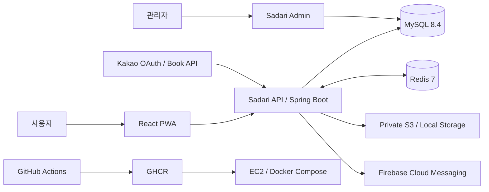

# Sadari

> 읽고, 기록하고, 함께 성장하는 독서 기록 플랫폼

Sadari는 도서 검색, 독서 기록과 목표, 소셜 활동, 독서 모임, 알림과 웹 푸시를 하나의 흐름으로 연결한 서비스입니다. 이 저장소는 사용자용 React PWA와 Spring Boot API를 함께 관리하며, 별도 [관리자 서비스](https://github.com/vellahw/sadari-admin)가 공통 운영 테이블을 통해 서비스의 제어면을 담당합니다.

## 프로젝트 핵심

| 관점 | 구현 내용 |
| --- | --- |
| 데이터 일관성 | 도서 마스터와 독후감 등록을 하나의 트랜잭션으로 처리하고, DB 커밋 결과에 맞춰 푸시 발송과 파일 정리를 수행합니다. |
| 인증과 세션 | Kakao OAuth 2.0, JWT Access/Refresh Token, HttpOnly Cookie, Redis 세션 메타데이터와 로그아웃 블랙리스트를 결합했습니다. |
| 조회 성능 | 마이페이지 독서 요약 SQL 왕복을 최대 19회에서 2회로 통합했습니다. 이는 소스 기준 호출 횟수 감소이며 응답 시간 개선율을 뜻하지 않습니다. |
| 운영 가능성 | 관리자가 공통 코드, 알림 템플릿, 사용자 메뉴와 스케줄러 상태를 관리하고 실행·실패 로그를 확인할 수 있습니다. |
| 배포 자동화 | 멀티 스테이지 Docker 빌드, GHCR 이미지 배포, EC2 Docker Compose 갱신과 HTTP 상태 확인을 GitHub Actions로 구성했습니다. |

## 주요 기능

| 영역 | 사용자 경험 | 백엔드 구현 |
| --- | --- | --- |
| 도서 | Kakao 도서 검색, 표지 색상 탐색 | 검색 API 연동, 표지 대표색 추출, CIELAB 거리 기반 공통 색상 매칭 |
| 독서 기록 | 읽기 상태, 별점, 독후감, 기간별 독서량 | 도서·독후감 원자적 등록, 공개 범위, 목표 집계와 목록 조회 |
| 독서 목표 | 주간·월간·연간 목표와 달성 현황 | 기간 경계 계산, 이전 목표 복사, 조건부 집계 |
| 소셜 | 팔로우, 프로필, 좋아요, 댓글 | 공개 데이터 범위 제어, 대상 유형 기반 반응 데이터 모델 |
| 독서 모임 | 모임 생성, 가입과 활동 관리 | 모임 상태·권한·정원 정책, 가입 요청과 멤버십 처리 |
| 알림과 푸시 | 서비스 알림, PWA 웹 푸시 | 템플릿 알림, 중복 방지, 커밋 후 FCM 발송, 구독 관리 |
| 계정 | 로그인, 비활성화, 탈퇴 예약과 취소 | Redis 세션, 상태 기반 접근 제한, `WITHDRAWN`·`DELETE_PENDING` 수명주기 |

## 시스템 구성

사용자 서비스와 관리자 서비스는 서로의 API를 직접 호출하지 않습니다. 두 서비스가 공유하는 운영 테이블에 쓰기 주체와 읽기 주체를 구분해, 사용자 요청 경로와 운영 제어 경로의 결합도를 낮췄습니다.

## 백엔드 설계 하이라이트

### 1. 반복 조회를 집계 SQL과 단일 목록 조회로 통합

마이페이지는 기간별 독서량, 목표, 달성 횟수와 도서 목록을 만들기 위해 최대 19번의 SQL을 실행하고 있었습니다. 완료 독후감을 CTE와 조건부 집계로 한 번 집계하고, 현재 읽는 책과 올해 완료 목록을 한 번 조회한 뒤 애플리케이션에서 기간별로 분류하도록 변경했습니다.

| 항목 | 개선 전 | 개선 후 |
| --- | ---: | ---: |
| 전체 SQL 호출 | 최대 19회 | 2회 |
| 집계 SQL | 15회 | 1회 |
| 목록 SQL | 4회 | 1회 |

호출 횟수는 약 89.5% 감소했습니다. 이 값은 코드 경로에서 계산한 SQL 왕복 감소율이며, 운영 환경의 평균·P95 응답 시간은 별도 측정이 필요합니다.

- [성능 개선 과정과 트레이드오프](docs/performance/my-page-reading-summary-optimization.md)
- [집계 SQL](src/main/java/org/our/sadari/report/mapper/ReportMapper.xml)

### 2. 인증 상태를 토큰 한 장이 아닌 수명주기로 관리

Kakao OAuth 로그인 이후 Access Token과 Refresh Token을 발급하고 HttpOnly Cookie로 전달합니다. Redis에는 Refresh Token, 닉네임과 계정 상태를 동일 TTL로 저장하며, 여러 키의 저장과 갱신은 Lua 스크립트로 원자적으로 처리합니다. 로그아웃한 Access Token의 `jti`는 남은 만료 시간 동안 블랙리스트로 유지합니다.

`JwtFilter`는 서명과 만료만 확인하지 않고 Redis의 계정 상태도 함께 검사합니다. 비활성화 계정과 영구 탈퇴 대기 계정은 허용된 복구·취소 흐름을 제외한 API 접근이 제한됩니다.

- [인증과 보안 설계](docs/portfolio/auth-security.md)
- [Redis 토큰·사용자 상태 관리](src/main/java/org/our/sadari/global/security/jwt/TokenRedisService.java)
- [JWT 요청 필터](src/main/java/org/our/sadari/global/security/jwt/JwtFilter.java)
- [계정 수명주기 정책](docs/policies/withdrawal-policy.md)

### 3. DB와 외부 시스템의 완료 시점을 분리

외부 시스템 호출을 DB 트랜잭션 안에서 성공한 것으로 간주하지 않습니다.

- 알림 데이터가 커밋된 뒤에만 FCM 푸시를 발송합니다.
- DB가 새 파일을 참조한 뒤 기존 물리 파일을 삭제합니다.
- DB가 롤백되면 해당 요청에서 먼저 생성한 물리 파일을 정리합니다.
- 도서 마스터가 없을 때 도서와 독후감 등록을 하나의 트랜잭션으로 처리합니다.

이를 통해 푸시는 발송됐지만 알림이 없는 상태, 롤백된 DB가 삭제된 파일을 계속 참조하는 상태, 도서만 남고 독후감 등록이 실패하는 상태를 줄였습니다.
