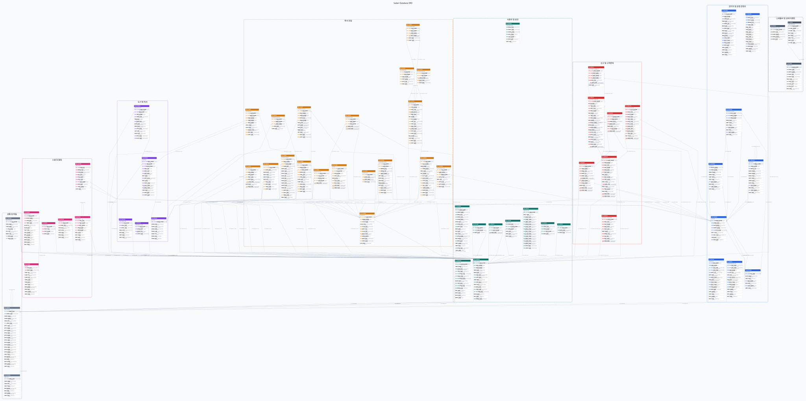

# Sadari 데이터베이스 ERD

## 개요

현재 데이터베이스 구조를 `scripts/db/mysql/01-create.sql`에서 자동 생성한 물리 ERD이다. 테이블명, 전체 컬럼명, 타입, PK·FK·자동 증가·NULL 제약, 기본값 및 DDL 코멘트를 표시한다.

## 산출물

| 파일                                 | 용도 |
|------------------------------------| --- |
| [PNG ERD](sadari-database.png)     | GitHub에서 확대 가능한 전체 관계도 |
| [SVG ERD](sadari-database.svg)     | GitHub에서 확대 가능한 전체 관계도 |
| [DBML 원본](sadari-database.dbml)    | dbdiagram.io 등 DBML 호환 도구에서 편집 가능한 구조 정의 |
| [Graphviz 원본](sadari-database.dot) | SVG 렌더링에 사용하는 관계도 원본 |

## 영역 색상

| 영역 | 색상 |
| --- | --- |
| 공통 및 파일 | 회색 |
| 관리자 및 운영 콘텐츠 | 파랑 |
| 사용자 및 보안 | 청록 |
| 도서 및 독서 | 보라 |
| 소셜 및 알림 | 분홍 |
| 독서 모임 | 주황 |
| 신고 및 고객문의 | 빨강 |
| 스케줄러 및 상태 이벤트 | 진회색 |

## 갱신 방법

`scripts/db/mysql/01-create.sql`을 변경한 뒤 다음 순서로 ERD를 다시 생성한다.

```powershell
Set-Location scripts/db/mysql/erd
npm ci
npm run generate
```

생성 파일 상단의 SHA-256 값은 기준 DDL의 내용과 연결되며 직접 수정하지 않는다.

## 전체 ERD


